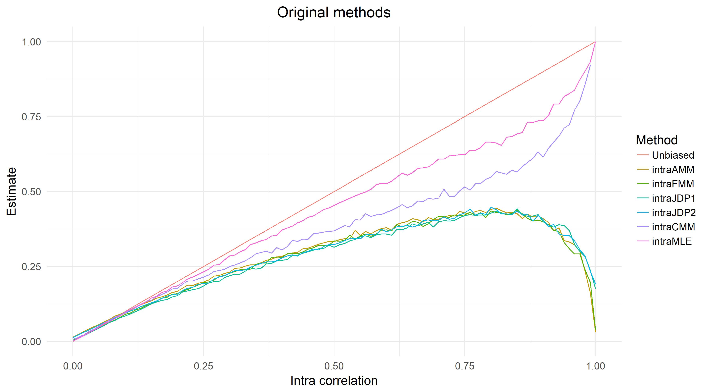
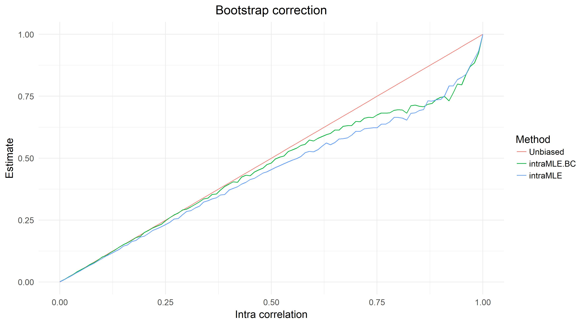

%\VignetteEngine{knitr::rmarkdown}
%\VignetteIndexEntry{An AssetCorr Guide}
%\VignetteEncoding{UTF-8}


```{r setup, include=FALSE,warning=TRUE}
library(knitr)
```

# An AssetCorr Guide

## Overview

AssetCorr is a package for the estimation of intra and inter asset correlations within the Vasicek Portfolio Model. The implemented methods are:

* intra correlation
  + Asymptotic Method of Moments ("intraAMM", Gordy (2000))
  + Finite Sample Method of Moments ("intraFMM", Gordy (2000))
  + Joint Default Probability Matching 1 ("intraJDP1", Lucas (1995))
  + Joint Default Probability Matching 2 ("intraJDP2", De Servigny and Renault (2002))
  + Corrected Method of Moments ("intraCMM", Frei and Wunsch (2018))
  + Binomial Maximum Likelihood Estimator ("intraMLE", Gordy and Heitfield (2010))
  + Asymptotic Maximum Likelihood Estimator ("intraAMLE",  Duellmann and Gehde-Trapp (2004))
  
* inter correlation
  + Covariance Matching Estimator ("interCov", Bluhm and Overbeck (2003))
  + Joint Default Probability Matching ("interJDP", De Servigny and Renault (2002))
  + Corrected Method of Moments ("interCMM", Frei and Wunsch (2018) )
  + Binomial Maximum Likelihood Estimator ("interMLE", Gordy and Heitfield (2010))
  + Copula Based Maximum Likelihood Estimator (interCopula, Pfeuffer et al. (2018))
 
## Bias of the estimation methodologies 
  
It is commonly known that these methods are exposed to an estimation bias, especially if the default time series is short, see for example Meyer (2009) or Duellmann et al.(2010). Furthermore, Loeffler (2003) has shown that wrongly estimated correlations have a huge impact on the resulting risk figures. To tackle this issue Pfeuffer et al. (2018) outlined the use of single and double bootstrap correction and additionally jackknife correction approaches to reduce the bias. The suggested correction methods and methods to infer confidence intervals are provided by the package AssetCorr. 

To illustrate the bias of intra correlation methods, consider the following example:

Suppose we have a default time series with the following properties:

* Length: 20 observations(years)
* Number of obligors: 1000
* Probability of default: 0.01

The following plot displays on the x-axis the true assumed value of the intra asset correlation and on the y-axis the estimated intra asset correlation as the mean of 1000 simulations:



As we can see, the bias of method of moments methodologies can be tremendous, especially as the level of intra correlation increases. Furthermore, the MLE approach shows the best performance.

Due to this large bias, Pfeuffer et al. (2018) suggested to use bootstrap and jackknife correction to reduce the bias. The following plot illustrates the combination of MLE and single bootstrap correction:



As one can see, the bootstrap correction moves the original line towards the true value (red line), which implies that the estimation efficiency was improved. This is especially true for the range from 0 to 0.6, which covers the empirical estimated range.

In the following, the functionality of AssetCorr will be briefly illustrated using a hypothetical default data time series. Load the package and generate a hypothetical default time series with the implemented function:
## Intra correlation
```{r}
library(AssetCorr)
set.seed(111)

#number of obligors: 1000
#intra asset correlation: 0.3
#length of the default time series: 20
#probability of default: 0.01

D1=defaultTimeseries(1000,0.3,20,0.01)
N1=rep(1000,20)
```

All methods for estimating the intra correlation have a very similar structure. Hence only one method will be used in the following. At the end of this section, another function will be illustrated which can be used to get an in depth analysis of the underlying default time series.
First, the point estimate for the intra correlation will be estimated:
```{r}
intraAMM(D1,N1)
```
As one can see, the Asymptotic Method of Moments underestimates the true value of 30% for the intra asset correlation. Hence Pfeuffer et al. (2018) suggested to use resampling methods to reduce this downward bias. Therefore, the single bootstrap correction will be illustrated in the following. This correction comes with the additional advantage that one can infer confidence intervals. Additionally, a plot of the bootstrap density can be generated:
```{r}
Output<-intraAMM(D1,N1, B=1000, CI_Boot = 0.95, plot=TRUE)

Output$Original
Output$Bootstrap
Output$CI_Boot
```

Furthermore, the double bootstrap correction achieves a higher order of bias reduction, but comes with a substantial increase in computational time. Hence the number of repetitions in the inner and outer loop is reduced to 100, which implies that the single bootstrap corrected estimate is now calculated with 100 repetitions (instead of 1000 as in the previous setting):

```{r}
Output<-intraAMM(D1,N1, DB=c(100,100))

Output$Original
Output$Bootstrap
Output$Double_Bootstrap

```
As one can see, the double bootstrap correction produces the closest estimate, compared to the true value of 0.3.

Additionally, a jackknife correction is implemented:
```{r}
intraAMM(D1,N1, JC=TRUE)

```

As an additional feature, the package AssetCorr provides the possibility to evaluate and visualize a default time series using a list of estimators simultaneously to obtain first insights. The default is set to use all intra correlation estimators. With respect to the computational time, we use only a selection of estimators:

```{r}
Output<-intraALL(D1,N1, B=500, plot=TRUE,Adjust = 0.0001, Estimator = c("AMM","FMM","CMM","JDP1","JDP2","AMLE") )
Output

```

## Inter correlation
Also the inter correlation estimates have a substantial impact on the portfolio's risk, various methods are implemented. First, two correlated default time series are generated.

```{r}
library(mvtnorm)
set.seed(2)
#number of obligors: 1000
#intra asset correlation 1: 0.3
#intra asset correlation 2: 0.1
#inter correlation of the systematic factors: 0.5
#length of the default time series: 20
#probability of default: 0.01

Psi=rmvnorm(20,sigma=matrix(c(1,0.5,0.5,1),2))
PDcond1=pnorm((qnorm(0.01)-sqrt(0.3)*Psi[,1])/sqrt(1-0.3))
PDcond2=pnorm((qnorm(0.01)-sqrt(0.1)*Psi[,2])/sqrt(1-0.1))

D1=rbinom(20,1000,PDcond1)
D2=rbinom(20,1000,PDcond2)
N1=N2=rep(1000,20)
```
All methods for estimating the intra correlation have a very similar structure. Hence only one method will be used in the following. 
First, the point estimate for the inter correlation will be calculated. For this purpose, the intra correlation estimates of the default time series serve as input:

```{r}
rho1=intraAMM(D1,N1)$Original
rho2=intraAMM(D2,N2)$Original

interCov(D1,N1,D2,N2,rho1,rho2)
```

Also for inter correlation methods the resampling corrections are implemented:

```{r}
#Single bootstrap Correction
rho1=intraAMM(D1,N1)$Original
rho2=intraAMM(D2,N2)$Original

Output<- interCov(D1,N1,D2,N2,rho1,rho2, B=1000, CI_Boot = 0.95, plot=TRUE)

Output$Original
Output$Bootstrap
Output$CI_Boot

#Double bootstrap correction

Output<- interCov(D1,N1,D2,N2,rho1,rho2, DB=c(100,100))

Output$Original
Output$Bootstrap
Output$Double_Bootstrap

#Furthermore, a Jackknife correction would be possible
```


## References
De Servigny, A. and O. Renault: _Default correlation: empirical evidence._ Working Paper, Standard and Poor's: 90-94, 2003. Available at: http://www.greta.it/credit/credit2003/Speaker/DeServigny_Renault.pdf. Accessed: 04.06.2018

Duellmann, K. and M. Gehde-Trapp: _Systematic risk in recovery rates: an empirical analysis of US corporate credit exposures._ Bundesbank Series 2, Discussion Paper (2): 2004. Available at: http://hdl.handle.net/10419/19729. Accessed: 04.06.2018

Duellmann, K., J. Kuell and M. Kunisch: _Estimating asset correlations from stock prices or default rates- Which method is superior?_ Journal of Economic Dynamics and Control 34(11): 2341-2357, 2010

Efron, B. and R. J. Tibshirani: _An introduction to the bootstrap._ CRC press, 1994

Pfeuffer M., M. Nagl , M. Fischer, and D. Roesch: _Parameter Estimation and Bias Correction in the Vasicek Credit Portfolio Model._  (In Preparation), 2018

Frei, C. and M. Wunsch: _Moment Estimators for Autocorrelated Time Series and their Application to Default Correlations._ Journal of Credit Risk 14: 1-29, 2018

Gordy, M. B.: _A comparative anatomy of credit risk models._ Journal of Banking &
Finance 24(1): 119-149, 2000

Gordy, M. B. and E. Heitfield: _Small-sample estimation of models of portfolio credit risk._ In Recent Advances in Financial Engineering: Proceedings of the KIER-TMU International Workshop on Financial Engineering, 2009: Otemachi, Sankei Plaza, Tokyo, 3-4 August
2009: 43-63, World Scientific, 2010

Hoese, S. and S. Huschens: _Confidence intervals for asset correlations in the asymptotic single risk factor model._ In Operations Research Proceedings 2010:  111-116, 2010

Kalkbrener, M. and A. Onwunta: _Validating structural credit portfolio models._ Model risk-identification, measurement and management. Risk Books, London: 233-261, 2010

Loeffler, G. _The effects of estimation error on measures of portfolio credit risk._ Journal of Banking & Finance 27(8): 1427-1453, 2003

Lucas, D. J.: _Default correlation and credit analysis._ The Journal of Fixed Income 4(4): 76-87, 1995

Meyer, C.: _Estimation of intra-sector asset correlations._ The Journal of Risk Model Validation 3(3): 47-79, 2009

Vasicek, O. A: _The distribution of loan portfolio value._ Risk 15(12): 160-162, 2002


